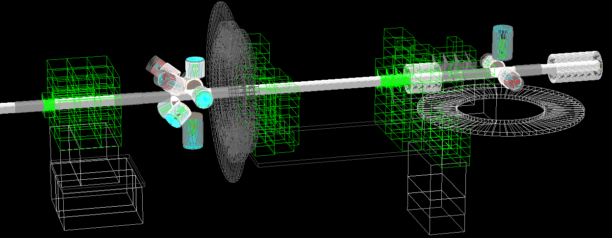

# Geant4 simulation of the UTR at HIγS



This is a [Geant4](https://geant4.web.cern.ch/) simulation of the Upstream Target Room (UTR) at the High Intensity γ-ray Source (HIγS) facility, located at the Duke Free Electron Laser Laboratory (DFELL) of the Triangle University Nuclear Laboratory (TUNL) at Duke University, Durham, NC, USA.


## Features

The following objects located in the target room are included in the simulation:

* Collimator
* Lead shieldings and walls
* Concrete wall and blocks
* Evacuated beam pipe and pipe holders
* γ³ setup, including the wheel
* 2nd setup (also called parasitic setup)
* 0° detector
* HPGe detectors of the TUNL and TU Darmstadt
* LaBr₃(Ce) detectors of the TU Darmstadt
* Polarimeter of the TU Darmstadt
* Metal tables
* Air
* A variety of filters, shieldings and smaller objects

The simulation does physics. *TODO*


## Getting started

These instructions will get you a copy of the simulation running.

### Dependencies

To build and run the simulation, the following dependencies are required:

* [Geant4](https://geant4.web.cern.ch/)
* CMake (*build*)
* Make (*build*)

### Compilation

To compile the simulation, simply execute

```bash
$ cmake .
$ make -j
```

This will create the `higs` binary in the top directory.


## Usage

To open the simulation, run the compiled `higs` binary. The visualization can be initialized with

    /control/execute init_vis.mac

This commands executes the `init_vis.mac` macro.

*TODO*


## License

*TODO*

